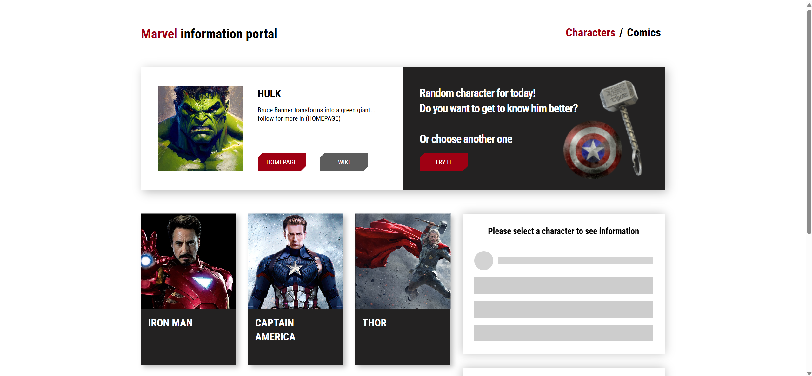

# 📘 Marvel information portal

## 🚀 Используемые технологии


## 📌 Описание
- Приложение предоставляет информацию о персонажах и комиксах Marvel.

- Просмотр списка персонажей и комиксов.

- Поиск персонажей по имени.

- Информация о каждом персонаже и комиксе.

---


## ⚙️ Установка и запуск проекта

1. Склонируйте проект:
   ```bash
   git clone https://github.com/Alexander-Klem/marvel-information-portal.git 
   ```
2. Установите зависимости:
   ```bash
   npm install
   ```
3. Запустите приложение:
    ```bash
   npm start
   ```
4. Откройте в браузере:
    ```bash
    http://localhost:3000
    ```

## 🌟 Особенности
- Динамическая подгрузка данных при скролле.

- Обработка ошибок (404, API-запросы).

- Анимации переходов между страницами.

- Оптимизация (ленивая загрузка компонентов).

